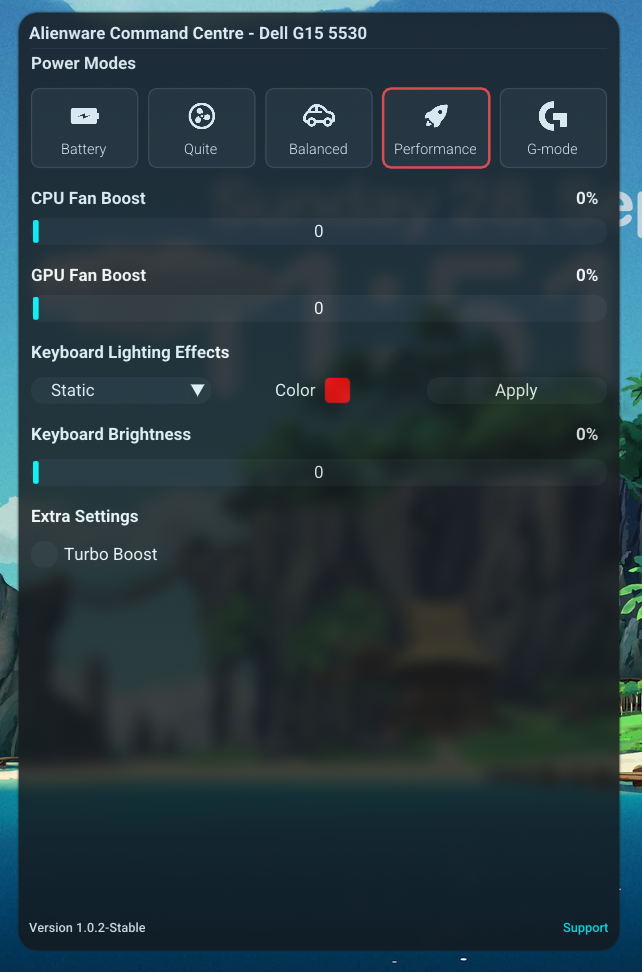

# AWCC for Alienware & Dell G series 🚀

AWCC is an unofficial alternative to Alienware Command Centre of Windows for the Dell G series and Alienware Series Laptops on Linux, supporting almost all features that the Windows version supports, including custom fan controls, light effects, g-mode, and autoboost.

🎮 **Discord community for support and feedback** :

[](https://discord.gg/EMWUTgegDm)

---

## ✨ Features

- 🖥️ **GUI and CLI support**
- ⚡ **Lightweight** (uses around ~130mb of RAM with GUI, else 6mb RAM)
- 🌈 **All Light Effects**
- 🧑‍💻 **Daemon Support** (no sudo needed if daemon is running)
- 🎮 **GMode and Light Key autobinding** just like Windows
- 🔥 **Supports All modes** that your device has
- 💻 **Supports all of G15 and G16** with some Alienware
- 🕵️ **No Telemetry and Open Source** :3
- 📈 **Custom Fan Curve** (Soon)

---

## 📸 Screenshots



---

## 🛠️ Building And Installation

#### 🦄 For Arch-Based Distros

```bash
paru -S awcc-git
```

### 🛠️ Manual Installation

**Dependencies** :

- `acpi_call-dkms`
- `git`
- `make`
- `cmake`
- `libusb`
- `glfw`
- `libx11`
- `libgl`

**Make Dependencies** :

> [!NOTE]
> Recommended to install them first if you want a faster compile progress

- `loguru`
- `nlohmann_json`
- `stb_image`
- `libevdev`

```bash
git clone https://github.com/tr1xem/AWCC
cd AWCC && mkdir build/
cd build && cmake ..
sudo make install
```

Then enable the `awccd.service` using :

```bash
sudo systemctl enable --now awccd.service
```

## Support and Feedback

Need support or want this project to support your device ? Join our [Discord community](https://discord.gg/EMWUTgegDm) or open a [Github Discussion](https://github.com/tr1xem/AWCC/discussions)

## Device Tested

**Tested on:**

- Dell G15 5530
- Dell G16 7630
- Dell G15 5511

## 🗺️ Roadmap

- [x] ♨️ Rewrite Thermal Core of AWCC in C++ with minimal API changes
- [x] 💡 Rewrite LightFX Core of AWCC in C++ with minimal API changes
- [x] 🖥️ CLI Mode
- [x] 📦 install script
- [x] 🖼️ GUI - Using `Dear ImGui` and some visuals from Windows version
- [ ] 🧩 Auto Zone identify using `libusb` and `Alien FX Sdk`
- [ ] 📊 Fan Curve for AutoBoost
- [x] 🖲️ Improved DMI and Normal Device Detection
- [x] 🧠 Better ACPI Executions with fallback and functions like `executeacip(0x2, 0x0, 0x0, 0x0)`
- [x] 🕹️ Support for Legacy `USTT` modes
- [x] 📝 JSON Config file and parsing
- [x] ⌨️ Grab Unmark keys directly from daemon using `evdev`
- [ ] 👾 Other Zones like head and support for `Alienware` - Low Priority
- [x] 🐞 Verbose and Debug Mode

## 🙏 Credits

- [GasparVardanyan](https://github.com/GasparVardanyan)
- [humanfx](https://github.com/tiagoporsch/humanfx)
- [meduk0](https://github.com/meduk0)
- [WMI Kernel Driver](https://docs.kernel.org/6.16/wmi/devices/alienware-wmi.html)

**“Intelligence is the ability to avoid doing work, yet getting the work done.”** _~Linus Torvalds_
