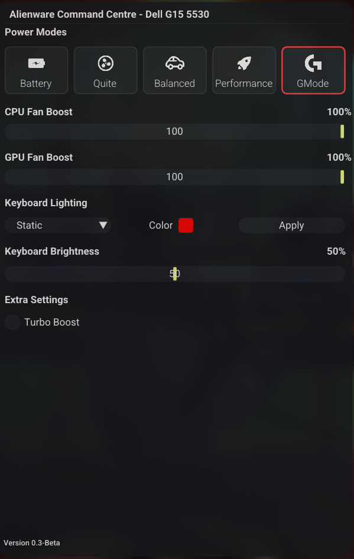

# AWCC for Alienware & Dell G series devices 🚀

[](https://github.com/tr1xem/AWCC/actions/workflows/build.yml)

AWCC\* is an unofficial alternative to Alienware Command Centre of Windows for
the Alienware Series Device on Linux, supporting almost all
features that the Windows version supports, including custom fan controls,
light effects, g-mode, and autoboost.

###### \*This project is not affiliated with, endorsed, sponsored, or produced by Dell. It is simply my personal contribution and hobby aimed at improving the Linux experience on Dell laptops.

🎮 **Discord community for support and feedback** :

[](https://discord.gg/EMWUTgegDm)

---

> [!NOTE]
> For lights and other light device that comes under dell (including everything
> like keyboard,mouse,monitors etc) try [AlienFX](https://github.com/tr1xem/alienfx-linux/)
> it would have a gui interface in awcc itself

## ✨ Features

- 🖥️ **GUI and CLI support**
- ⚡ **Lightweight** (uses around ~88mb of RAM with GUI open, else 6mb RAM while running in background)
- 🌈 **All Light Effects**
- 🧑‍💻 **Daemon Support** (no sudo needed if daemon is running)
- 🎮 **GMode and Light Key autobinding** just like Windows
- 🔥 **Supports All modes** that your device has
- 💻 **Supports all of Alienware device** in including keyboard,mouse,monitors etc
- 🕵️ \*_No Telemetry and Open Source_
- 📈 **Custom Fan Curve** (Soon)

---

## 📸 Screenshots



---

## 🛠️ Building And Installation

#### 🗿 For Arch-Based Distros

```bash
paru -S awcc-bin
```

### 🛠️ Manual Installation

**Dependencies** :

- `acpi_call-dkms` (Most important)
- `libx11`
- `libgl` or `libglvnd`

**Make Dependencies** :

> [!NOTE]
> Can be removed after installing

- `cmake`
- `ninja`
- `meson`

OR if you are a debianoid

```
sudo apt-get install acpi-call-dkms git meson ninja-build cmake libx11-dev libgl-dev pkgconf g++-13 libxkbcommon-dev libglfw3 libudev-dev pkexec
```

```bash
git clone https://github.com/tr1xem/AWCC
cd AWCC && mkdir build/
cd build && cmake .. -G Ninja
sudo ninja install
```

Then enable the `awccd.service` using :

```bash
sudo systemctl enable --now awccd.service
```

Reload udev rules using

```
sudo udevadm control --reload-rules
sudo udevadm trigger
```

Load ACPI module using

```
sudo modprobe acpi_call
```

> [!TIP]
> Do `echo acpi_call | sudo tee /etc/modules-load.d/acpi_call.conf` to make
> acpi_call module auto load on startup so u dont have to type modprobe command
> everytime

## Frequently Asked Questions

- **Auto enable gmode on game launch**?

Install [gamemode](https://github.com/FeralInteractive/gamemode) using your package manager

To autostart the gmode profile on game launch add following changes to: `/etc/gamemode.ini`

```ini
[custom]
start=/usr/bin/awcc g
end=/usr/bin/awcc b
script_timeout=3
```

and now edit game's launch command to use gamemode `gamemoderun ./game` (or `gamemoderun %command%` if you are using steam) and it would autotoggle gmode on starting a game

Thanks to [@kevin](https://github.com/kraaijmakers) for this snippet

## Support and Feedback

Need support or want this project to support your device ? Join our [Discord community](https://discord.gg/EMWUTgegDm) or open a [Github Discussion](https://github.com/tr1xem/AWCC/discussions)

## Device Tested

<details>
  <summary><b>Devices tested:</b></summary>

- Alienware 16 Area-51 AA16250
- Alienware 16 Aurora AC16250
- Alienware 16 Aurora AC16251
- Alienware 16X Aurora AC16251
- Alienware 17 R5
- Alienware 18 Area-51 AA18250
- Alienware Area-51 AAT2250
- Alienware Area-51m
- Alienware Area-51m R2
- Alienware Aurora ACT1250
- Alienware Aurora R12
- Alienware Aurora R15
- Alienware Aurora R16
- Alienware Aurora R7
- Alienware Aurora R9
- Alienware Aurora Ryzen Edition
- Alienware m15 R3
- Alienware m15 R4
- Alienware m15 R6
- Alienware m15 R7
- Alienware m15 Ryzen Ed. R5
- Alienware m16 R1
- Alienware m16 R1 AMD
- Alienware m16 R2
- Alienware m17 R2
- Alienware m17 R5 AMD
- Alienware m18 R1
- Alienware m18 R1 AMD
- Alienware m18 R2
- Alienware x14 R2
- Alienware x15 R2
- Alienware x16 R2
- Alienware x17 R1
- Dell G15 5510
- Dell G15 5511
- Dell G15 5515
- Dell G15 5520
- Dell G15 5525
- Dell G15 5530
- Dell G15 Special Edition 5521
- Dell G16 7620
- Dell G16 7630
- G3 3590
- G5 5590
- G7 7500
- G7 7700

</details>

## 🗺️ Roadmap

- [x] ♨️ Rewrite Thermal Core of AWCC in C++ with minimal API changes
- [x] 💡 Rewrite LightFX Core of AWCC in C++ with minimal API changes
- [x] 🖥️ CLI Mode
- [x] 📦 install script
- [x] 🖼️ GUI - Using `Dear ImGui` and some visuals from Windows version
- [ ] ~~🧩 Auto Zone identify using `libusb` and `Alien FX Sdk` (New GUI)~~
- [ ] ~~📊 Fan Curve for AutoBoost (New GUI)~~
- [x] 🖲️ Improved DMI and Normal Device Detection
- [x] 🧠 Better ACPI Executions with fallback and functions like `executeacip(0x2, 0x0, 0x0, 0x0)`
- [x] 🕹️ Support for Legacy `USTT` modes
- [x] 📝 JSON Config file and parsing
- [x] ⌨️ Grab Unmark keys directly from daemon using `evdev`
- [x] 👾 Other Zones like head and support for `Alienware` - Low Priority (https://github.com/tr1xem/alienfx-linux/tree/main/AlienFX-SDK)
- [x] 🐞 Verbose and Debug Mode
- [x] New backend for thermal mode (https://github.com/tr1xem/alienfx-linux/tree/main/AlienFan-SDK)

## 🙏 Credits

- [GasparVardanyan](https://github.com/GasparVardanyan)
- [humanfx](https://github.com/tiagoporsch/humanfx)
- [meduk0](https://github.com/meduk0)
- [WMI Kernel Driver](https://docs.kernel.org/6.16/wmi/devices/alienware-wmi.html)

**“Intelligence is the ability to avoid doing work, yet getting the work done.”** _~Linus Torvalds_
