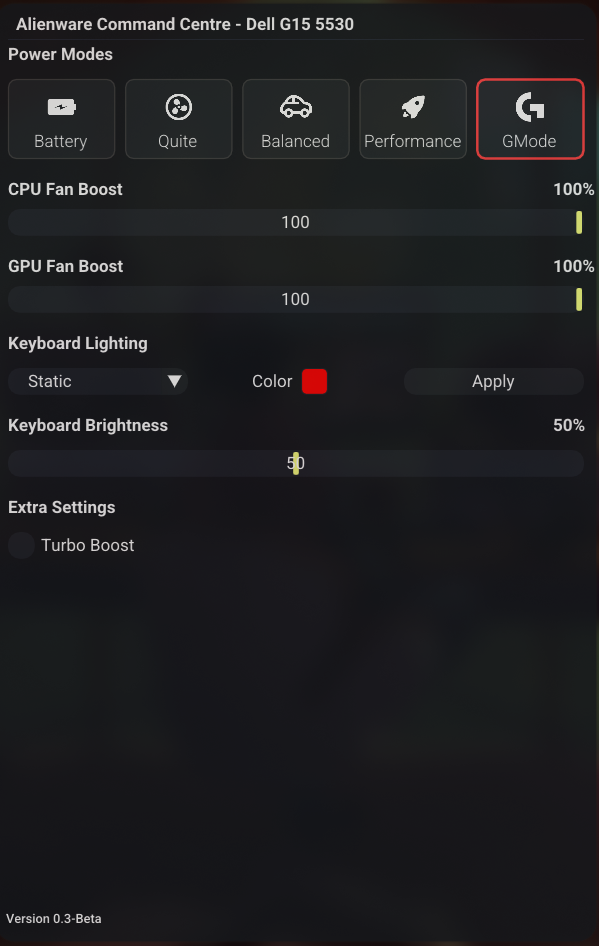

# AWCC for Alienware & Dell G series devices 🚀

[](https://github.com/tr1xem/AWCC/actions/workflows/build.yml)

AWCC\* is an unofficial alternative to Alienware Command Centre of Windows for
the Alienware Series Device on Linux, supporting almost all
features that the Windows version supports, including custom fan controls,
light effects, g-mode, and autoboost.

###### \*This project is not affiliated with, endorsed, sponsored, or produced by Dell. It is simply my personal contribution and hobby aimed at improving the Linux experience on Dell laptops.

🎮 **Discord community for support and feedback** :

[](https://discord.gg/EMWUTgegDm)

---

> [!NOTE]
> For lights and other light device that comes under dell (including everything
> like keyboard,mouse,monitors etc) try [AlienFX](https://github.com/tr1xem/alienfx-linux/)
> it would have a gui interface in awcc itself

## ✨ Features

- 🖥️ **GUI and CLI support**
- ⚡ **Lightweight** (uses around ~88mb of RAM with GUI open, else 4mb RAM while running in background)
- 🌈 **All Light Effects**
- 🧑‍💻 **Daemon Support** (no sudo needed if daemon is running)
- 🎮 **GMode and Light Key autobinding** just like Windows
- 🔥 **Supports All modes** that your device has
- 💻 **Supports all of Alienware device** in including keyboard,mouse,monitors etc
- 🕵️ \*_No Telemetry and Open Source_
- 📈 **Software fan curve** in the GUI. It runs while the window is open or hidden, and it stops when you Quit AWCC.

---

## 📸 Screenshots



---

## Testing

`cmake -S . -B build -G Ninja -DAWCC_BUILD_TESTS=ON`, then `cmake --build build` and `ctest --test-dir build --output-on-failure`.

`pipe` starts `awcc`, writes to its stdin, and checks stdout, stderr, and the exit code. The cases are `--test-mode` with `-h`, `--help`, no command, and an unknown command. `--test-mode` is a flag, so those cases pass on a machine that is not listed in `database.json`. `lint` walks the C and C++ sources for trailing whitespace, CR bytes, a missing final newline, and conflict markers. Neither test names a laptop or opens a USB device. GitHub Actions runs both on every pull request, and once more on each push to `main`.

## 🛠️ Building And Installation

#### 🗿 For Arch-Based Distros

```bash
paru -S awcc-bin
```

### 🛠️ Manual Installation

**Dependencies** :

- `acpi_call-dkms` (Most important)
- `libx11`
- `libgl` or `libglvnd`

**Make Dependencies** :

> [!NOTE]
> Can be removed after installing

- `cmake`
- `ninja`
- `meson`


#### 🗿 For NixOS

Add flake input in your config:

```nix
awcc = {
  url = "github:tr1xem/AWCC";
  inputs.nixpkgs.follows = "nixpkgs";
}
```

Then, import `awcc.nixosModules.default` anywhere in your config and add `acpi_call` as kernel module.

Example flake part `awcc.nix` setup:

```nix
{ ... }: {
  flake.modules.nixos."system.awcc" = { inputs, config, pkgs, ... }: {
    imports = [ inputs.awcc.nixosModules.default ];
    boot.kernelModules = [ "acpi_call" ];
    boot.extraModulePackages = with config.boot.kernelPackages; [ acpi_call ];
  };
}
```


OR if you are a debianoid

```
sudo apt-get install acpi-call-dkms git meson ninja-build cmake libx11-dev libgl-dev pkgconf g++-13 libxkbcommon-dev libglfw3 libudev-dev pkexec libwayland-bin libwayland-dev libxrandr-dev libxinerama-dev libcursor-dev libxi-dev
```

```bash
git clone https://github.com/tr1xem/AWCC
cd AWCC && mkdir build/
cd build && cmake .. -G Ninja
sudo ninja install
```

Then enable the `awccd.service` using :

```bash
sudo systemctl enable --now awccd.service
```

Reload udev rules using

```
sudo udevadm control --reload-rules
sudo udevadm trigger
```

Load ACPI module using

```
sudo modprobe acpi_call
```

> [!TIP]
> Do `echo acpi_call | sudo tee /etc/modules-load.d/acpi_call.conf` to make
> acpi_call module auto load on startup so u dont have to type modprobe command
> everytime

## Frequently Asked Questions

- **Auto enable gmode on game launch**?

Install [gamemode](https://github.com/FeralInteractive/gamemode) using your package manager

To autostart the gmode profile on game launch add following changes to: `/etc/gamemode.ini`

```ini
[custom]
start=/usr/bin/awcc g
end=/usr/bin/awcc b
script_timeout=3
```

and now edit game's launch command to use gamemode `gamemoderun ./game` (or `gamemoderun %command%` if you are using steam) and it would autotoggle gmode on starting a game

## Support and Feedback

Need support or want this project to support your device ? Join our [Discord community](https://discord.gg/EMWUTgegDm) or open a [Github Discussion](https://github.com/tr1xem/AWCC/discussions)

## Lighting

The device list below is the upstream thermal and feature test list. It does not mean every light works on every model.

AWCC does not link the AlienFX SDK. The GUI runs `alienfx_cli` directly, with no shell. It uses `AWCC_ALIENFX_CLI` when that path is set and executable, otherwise `alienfx_cli` on `PATH`, otherwise `~/.local/bin/alienfx_cli`. `AWCC_DATABASE` selects `database.json`. When it is unset, the GUI reads `/etc/awcc/database.json`.

On the Alienware 16 Area-51 AA16250 the lights are two devices:

- Darfon keyboard `0d62:1bbc`. Per-key color, keyboard effects, and keyboard brightness go through `setkeys`, `keyboardeffect`, and `keyboarddim`.
- AW-ELC `187c:0551` (also `0550`). The lightbar, logo, speakers, trackpad, and power button stay on AWCC's EffectController. The power button is zone `0x1b`. Static colors use `powerbutton`. Rainbow uses `powerrainbow`, because that one LED keeps its own hardware profile and a chassis rainbow on it strobes.

Those keyboard commands are selected by USB id. Other keyboards keep the upstream `alienfx_cli` protocol. The Alienware 18 Area-51 AA18250 is in the thermal list and is not verified for keyboard lights.

The keyboard page draws the AA16250 deck, including the power button and the trackpad. Apply on Keyboard covers the keys, the power button, and the trackpad. The Power page and the Trackpad page can override just those parts afterward. Effect menus show a simple preview of the selected effect. The preview is not locked to the firmware's timing. The last successful Apply is stored in `$XDG_CONFIG_HOME/awcc/lighting.json`, or `~/.config/awcc/lighting.json`. A change made only with `alienfx_cli` is not shown until the next Apply in AWCC.

On other models, the AWCC command line and All lighting still use that model's `keyboardZones`. The separate Logo, Lightbar, Speakers, Trackpad, and Power pages split zones with the AA16250 ranges, so those pages can be empty on another model. The on-screen keyboard is an AA16250 picture.

`app/70-awcc.rules` grants the desktop user the ELC and Darfon hidraw nodes. The file is named `70-` so it is applied before systemd's seat rules. Install still needs `udevadm control --reload-rules` and `udevadm trigger`.

If `alienfx_cli` is missing, the sidebar can download the latest `tr1xem/alienfx-linux` release into `~/.local/bin`. That release does not include `setkeys`, `keyboardeffect`, `keyboarddim`, `powerbutton`, or `powerrainbow` until those commands are in a published release. Point `AWCC_ALIENFX_CLI` at a build of this fork until then.

## GUI

The window has no OS title bar. The top bar has Launch on startup, Hide to background, and Quit AWCC. The window X and Hide to background only hide the window, so a software fan curve can keep running. Quit AWCC stops the process. A second launch shows the window that is already running.

The left navbar stays on screen. Its selection slides to the new item, and the page fades when you change section. Lighting pages are Keyboard, Logo, Lightbar, Speakers, Trackpad, Power, and All lighting.

Performance shows the thermal modes with a sliding highlight and a short tooltip on each mode. Fan Extra is a boost on top of the thermal mode, not a percent of maximum fan speed. At 0 the thermal mode still runs the fans. The optional fan curve replaces Extra while it is enabled. It is saved under `~/.config/awcc/fan-curve.json`.

Color pickers commit with OK and restore the previous color with Cancel or a click away. Key legends are black or white against the key color. Each lighting page says whether AWCC has applied a setting yet. Until then the deck is gray, not a default red.

## Device Tested

<details>
  <summary><b>Devices tested:</b></summary>

- G7 7700
- G7 7500
- G5 5590
- G5 5505
- G3 3590
- Dell G16 7630
- Dell G16 7620
- Dell G15 Special Edition 5521
- Dell G15 5535
- Dell G15 5530
- Dell G15 5525
- Dell G15 5520
- Dell G15 5515
- Dell G15 5511
- Dell G15 5510
- Alienware x17 R2
- Alienware x17 R1
- Alienware x16 R2
- Alienware x15 R2
- Alienware x14 R2
- Alienware x14
- Alienware m18 R2
- Alienware m18 R1 AMD
- Alienware m18 R1
- Alienware m17 R5 AMD
- Alienware m17 R2
- Alienware m16 R2
- Alienware m16 R1 AMD
- Alienware m16 R1
- Alienware m15 Ryzen Ed. R5
- Alienware m15 R7 AMD
- Alienware m15 R7
- Alienware m15 R6
- Alienware m15 R4
- Alienware m15 R3
- Alienware m15
- Alienware Aurora Ryzen Edition
- Alienware Aurora R9
- Alienware Aurora R7
- Alienware Aurora R16
- Alienware Aurora R15
- Alienware Aurora R12
- Alienware Aurora R11
- Alienware Aurora ACT1250
- Alienware Area-51m R2
- Alienware Area-51m
- Alienware Area-51 AAT2250
- Alienware 18 Area-51 AA18250
- Alienware 17 R5
- Alienware 16X Aurora AC16251
- Alienware 16 Aurora AC16251
- Alienware 16 Aurora AC16250
- Alienware 16 Area-51 AA16250

</details>

## 🗺️ Roadmap

- [x] ♨️ Rewrite Thermal Core of AWCC in C++ with minimal API changes
- [x] 💡 Rewrite LightFX Core of AWCC in C++ with minimal API changes
- [x] 🖥️ CLI Mode
- [x] 📦 install script
- [x] 🖼️ GUI - Using `Dear ImGui` and some visuals from Windows version
- [ ] ~~🧩 Auto Zone identify using `libusb` and `Alien FX Sdk` (New GUI)~~
- [ ] ~~📊 Fan Curve for AutoBoost (New GUI)~~
- [x] 🖲️ Improved DMI and Normal Device Detection
- [x] 🧠 Better ACPI Executions with fallback and functions like `executeacip(0x2, 0x0, 0x0, 0x0)`
- [x] 🕹️ Support for Legacy `USTT` modes
- [x] 📝 JSON Config file and parsing
- [x] ⌨️ Grab Unmark keys directly from daemon using `evdev`
- [x] 👾 Other Zones like head and support for `Alienware` - Low Priority (https://github.com/tr1xem/alienfx-linux/tree/main/AlienFX-SDK)
- [x] 🐞 Verbose and Debug Mode
- [x] New backend for thermal mode (https://github.com/tr1xem/alienfx-linux/tree/main/AlienFan-SDK)

## 🙏 Credits

- [GasparVardanyan](https://github.com/GasparVardanyan)
- [humanfx](https://github.com/tiagoporsch/humanfx)
- [randomboi404](https://github.com/randomboi404) (NixOS Support)
- [meduk0](https://github.com/meduk0)
- [kevin](https://github.com/kraaijmakers) (G-Mode snippet)
- [WMI Kernel Driver](https://docs.kernel.org/6.16/wmi/devices/alienware-wmi.html)

**“Intelligence is the ability to avoid doing work, yet getting the work done.”** _~Linus Torvalds_
